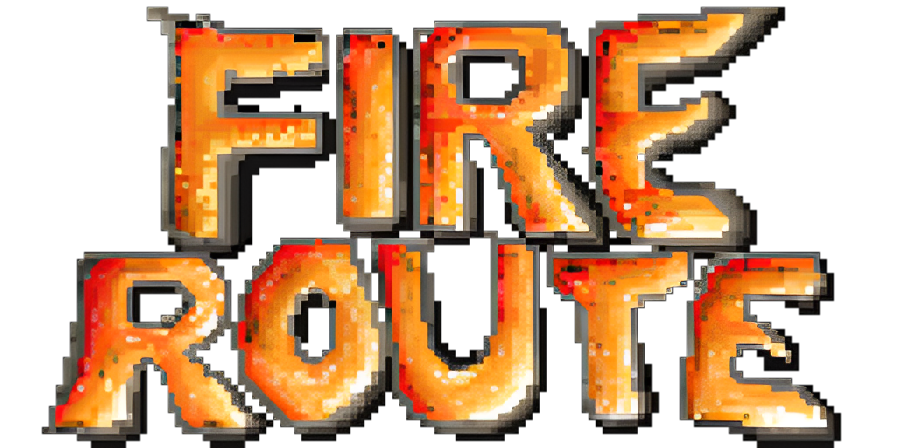
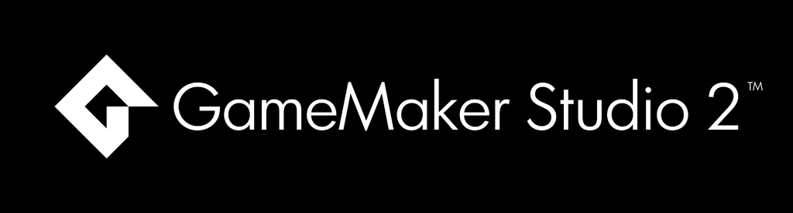

# O que é o Fire Route?

<div align="center"> </div> 

Fire Route, foi um projeto de jogo desenvolvido para TCC (Trabalho de Conclusão de Curso), de gênero RPG (Role-playing game) com temática de aventura, onde o jogador controlaria um bombeiro militar que enfrentaria inúmeras missões de bombeiro, onde dentre elas, envolveria situações de emergência, a fim de ensinar primeiros socorros e incentivar a busca por tal conhecimento, de modo que o jogador pudesse adquirir ciência, sobre como agir em situação de emergência. 

O projeto visava ser educativo e divertido, haja vista, que geralmente, os jogos educacionais possuem menos relevância e atratividade pelo público de consumidores do mercado de jogos, em comparação com jogos produzidos para entreter. Jogos para entretenimento também podem agregar valor de conhecimento e ajudar a desenvolver habilidades específicas, porém eles não são produzidos com nenhuma finalidade educacional ou com algum profissional pedagogo, que auxilie os desenvolvedores a como implementar extratégias efetivas, com o "equilíbrio" ideal, entre entretenimento e educação, para que a experiência não se torne cansativa e faça o jogador desistir.

_Abaixo, há o link do site que você pode acessar para conferi-lo e testar o jogo_

**Site**:  https://projetos-alisson.github.io/Fire-Route/

# Problemática e justificativa:

<ul>
  <li>Monotonia nos jogos educativos e pouca atratividade; </li>
<li>Escassez de jogos com fins pedagógicos, que sejam divertidos;</li>
<li>Vinculação negativa dos videogames, através da mídia televisiva;</li>
<li>Subestimação de uma ferramenta que poderia ser usado na pedagogia;</li>
<li>O projeto Fire Route, pretende melhorar a maneira como são vistos os jogos digitais, além de desenvolver um jogo educativo que possa entreter, enquanto incentiva a busca por conhecimentos de primeiros socorros.</li>
</ul>

# Descontinuado

Este projeto foi descontinuado devido a desafios com a colaboração e compromissos dos membros do grupo. A maior parte do desenvolvimento foi realizada por mim, Alisson, para garantir a conclusão dos requisitos necessários para a conclusão do ensino médio e do curso.

Apesar de vários esforços para envolver todos os membros do grupo, as contribuições não foram consistentes e as metas iniciais do projeto não foram alcançadas. Como resultado, o projeto não avançou conforme o planejado.

Os nomes e fotos dos membros do grupo foram removidos do site, pois as responsabilidades atribuídas não foram cumpridas conforme o esperado. Decidi manter apenas as minhas informações.

Devido as dificuldades de se desenvolver um jogo independente, ainda mais, desacompanhado de um time, para esse projeto ser retomado, seria preciso, um maior aperfeiçoamento das minhas habilidades, nas diferentes áreas de desenvolvimento, necessárias na criação de um jogo, como também, colegas que pudessem me ajudar.


<h1>**IMPORTANTE!!**</h1>

Devido a sepração do time, caso queira entrar em contato pelo site, favor contatar pelo email: mealisson00@gmail.com 


# GameMaker Studio 2  

<div > </div> 

Para este projeto foi utilizado o software, **Game Maker Studio 2**, através da linguagem de programação do próprio Game Maker: **Game Maker Language** **(GML)**. 

**EXEMPLO DE CÓDIGO GML (à título de curiosidade):**

```
//Sistema de Movimentação
var _left = keyboard_check(vk_left);
var _right = keyboard_check(vk_right);
var _up = keyboard_check(vk_up);
var _down = keyboard_check(vk_down);
var _hspd = _right - _left;
var _vspd = _down - _up;

if (_hspd != 0 || _vspd != 0)
{
    var _spd = 4;
    var _dir = point_direction(0, 0, _hspd, _vspd);
    var _xadd = lengthdir_x(_spd, _dir);
    var _yadd = lengthdir_y(_spd, _dir);
    x = x + _xadd;
    y = y + _yadd;
}
```

# Google Forms
Foi utilizada uma pesquisa descritiva, com o auxílio da plataforma Google Forms, para coleta de dados para aperfeiçoamento do projeto. 


